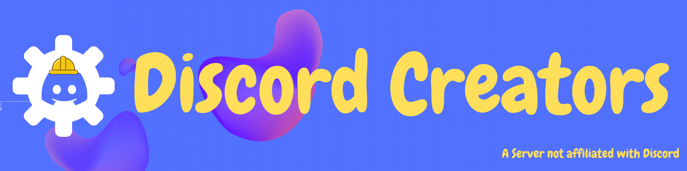

<p align="center"><a href="https://nodei.co/npm/discord-hybrid-sharding/"></a></p>
<p align="center">     <a href="https://discord.gg/YTdNBHh"></a></p>

# Discord-Hybrid-Sharding

Scale your bot efficiently with hybrid sharding — combining process and internal sharding (m shards on n processes) for minimizing your resource usage.

Battle-tested against bots managing up to 600k Guilds, reducing resource overhead (process idle usage) by 40-60% versus common sharding managers (discord.js). Works seamlessly with any Discord framework.

### Featured by Discord Creators

[Private Community for Verified Bot Developers. ](https://discord.gg/R3hPevRtUV)
[Meet large and small bot developers and have a nice exchange...](https://discord.gg/R3hPevRtUV)

<p>
<a href="https://discord.gg/R3hPevRtUV">

</a>
</p>

## Why?

Imagine this: if you used the djs sharding manager for 14 shards, your bot would consume around 200MB\*14=2.8GB of RAM when idle. On the other hand, hosting all shards in one process would only use about 200MB (idle process usage). However, once your bot grows beyond 22,000 guilds, internal sharding becomes less efficient, leading to performance issues as one process handles a large number of events.
Why not combine the best of both worlds to efficiently scale up your bot? This approach has been standard practice for large bots for years. Plus, with customizable parameters for processes and shards, you can optimize it to fit your specific needs.

-   **Easy migration from other ShardingMangers (Djs, Eris and co) like the one from djs (just renaming)**
-   **Seamless ReClustering/ReSharding/Restarts**
-   **Decentralized BroadCastEval function for listenerless operation, minimizing memory leaks and the need of the client to be ready**
-   **Heartbeat System to automatically respawn unresponsive or dead `ClusterClient`s**
-   **IPC System enabling communication between Client and ClusterManager via `.request()`, `.reply()`, `.send()` methods**
-   **Precise control over cluster queue with methods like `manager.queue.next()`, `.stop()`, `.resume()`**
-   Memory efficiency resulting in 40-60% less memory consumption during clustering
-   Detailed event debugging providing comprehensive cluster information
-   Additional functions like evalOnManager for more control
-   Support for string and functions with context in `.broadcastEval()`
-   Optional timeout feature in `.broadcastEval()` to mitigate memory leaks and unresponsiveness
-   **[Cross-Hosting Support: Manage Shards/Clusters across machines and facilitate cross-host communication (`IPC`, `.broadcastEval()`)](https://npmjs.com/discord-cross-hosting)**
    > Hybrid-Sharding handles threading logic, while your chosen library manages other aspects. Note: Ratelimits won't sync across clusters; consider using a rest proxy like (@discordjs/rest, nirn-proxy, ...)

## How does it work?

The system utilizes clusters or master shards, similar to regular shards in a sharding manager. These clusters can spawn internal shards, reducing the need for as many regular shards. For example, in a Discord bot with 4000 guilds, instead of spawning 4 shards with the Sharding Manager (approximately 4 x 200MB memory on idle), we start with 2 clusters/master shards, each spawning 2 internal shards. This results in a saving of 2 shards compared to the regular Sharding Manager (approximately 2 x 200MB memory).

**If you need help, feel free to join following <a href="https://discord.gg/YTdNBHh">discord server</a>.**

## Getting Started

### 1. Installation

```cli
npm i discord-hybrid-sharding
```

### 2. Setup

Create the cluster.js file, which will contain the ClusterManager for managing the processes/clusters.

```js
// Typescript: import { ClusterManager } from 'discord-hybrid-sharding'
const { ClusterManager } = require('discord-hybrid-sharding');

const manager = new ClusterManager(`${__dirname}/bot.js`, {
    totalShards: 'auto', // or numeric shard count
    /// Check below for more options
    shardsPerClusters: 2, // 2 shards per process
    // totalClusters: 7,
    mode: 'process', // you can also choose "worker"
    token: 'YOUR_TOKEN',
});

manager.on('clusterCreate', cluster => console.log(`Launched Cluster ${cluster.id}`));
manager.spawn({ timeout: -1 });
```

Refactor your main `bot.js` file and provide the sharding parameters to your discord.js client.

```js
// Typescript: import { ClusterClient, getInfo } from 'discord-hybrid-sharding'
const { ClusterClient, getInfo } = require('discord-hybrid-sharding');
const Discord = require('discord.js');

const client = new Discord.Client({
    shards: getInfo().SHARD_LIST, // An array of shards that will get spawned
    shardCount: getInfo().TOTAL_SHARDS, // Total number of shards
    intents: [],
});

client.cluster = new ClusterClient(client); // initialize the Client, so we access the .broadcastEval()
client.login('YOUR_TOKEN');
```

### 3. Start

Start your project by running `node cluster.js`, which will start the ClusterManager and start spawning the processes.

## Quick Overview

### Evaling over clusters

_Following examples assume that your `Discord.Client` is called `client`._

```js
client.cluster
    .broadcastEval(`this.guilds.cache.size`)
    .then(results => console.log(`${results.reduce((prev, val) => prev + val, 0)} total guilds`));

// or with a callback function
client.cluster
    .broadcastEval(c => c.guilds.cache.size)
    .then(results => console.log(`${results.reduce((prev, val) => prev + val, 0)} total guilds`));
```

### ClusterManager

| Option            | Type                  | Default  | Description                                                                                                                       |
| ----------------- | --------------------- | -------- | --------------------------------------------------------------------------------------------------------------------------------- |
| totalShards       | number or string      | "auto"   | Amount of internal shards which will be spawned                                                                                   |
| totalClusters     | number or string      | "auto"   | Amount of processes/clusters which will be spawned                                                                                |
| shardsPerClusters | number or string      | -        | Amount of shards which will be in one process/cluster                                                                             |
| shardList         | Array[number]         | -        | OPTIONAL - On cross-hosting or spawning specific shards you can provide a shardList of internal Shard IDs, which will get spawned |
| mode              | "worker" or "process" | "worker" | ClusterManager mode for the processes                                                                                             |
| token             | string                | -        | OPTIONAL -Bot token is only required totalShards are set to "auto"                                                                |

The Manager.spawn options are the same as for Sharding Manager

### Cluster Events

| Event         | Description                                                       |
| ------------- | ----------------------------------------------------------------- |
| clusterCreate | Triggered when a cluster gets spawned                             |
| clusterReady  | Triggers if the client has fired the ready event for that cluster |

### Cluster Client Properties

All properties like the ones for `.broadcastEval()` are available, just replace the `client.shard` with `client.cluster`
Other properties:
| Property | Description |
| ------------- | -------------- |
| client.cluster.count | Returns the amount of all clusters |
| client.cluster.id | Returns the current cluster ID |
| client.cluster.shardList | Returns an array of shard ids on the current cluster |
| client.cluster.shards | Returns the client.ws.shards collection |

# Changes | Migrating to Discord-Hybrid-Sharding

Options are now labeled as `cluster` instead of `shard`:

```diff
- client.shard...
+ client.cluster...

- .broadcastEval((c, context) => c.guilds.cache.get(context.guildId), { context: { guildId: '1234' }, shard: 0 })
+ .broadcastEval((c, context) => c.guilds.cache.get(context.guildId), { context: { guildId: '1234' }, cluster: 0 })
```

Small changes in naming conventions:

```diff
- client.shard.respawnAll({ shardDelay = 5000, respawnDelay = 500, timeout = 30000 })
+ client.cluster.respawnAll({ clusterDelay: 5000, respawnDelay: 5500, timeout: 30000 })

- manager.shard.respawnAll({ shardDelay = 5000, respawnDelay = 500, timeout = 30000 })
+ manager.respawnAll({ clusterDelay: 5000, respawnDelay: 5500, timeout: 30000 })

```

Get current cluster ID:

```diff
- client.shard.id
+ client.cluster.id
```

Get current shard ID:

```diff
- client.shard.id
+ message.guild.shardId
```

Get total shards count:

```diff
- client.shard.count
+ client.cluster.info.TOTAL_SHARDS
```

Get all ShardID's in the current cluster:

```diff
- client.shard.id
+ client.cluster.shardList // Array of internal shard ids
+ client.cluster.shards // Collection of ws shards
```

# New Features

## `Zero Downtime Reclustering`:

Zero Downtime Reclustering is a Plugin, which is used to reshard/recluster or even restart your bot with having a theoretical outage of some seconds.
There are two options for the `restartMode`:

-   `gracefulSwitch`: Spawns all new Clusters with the provided Info in maintenance mode, once all clusters have been spawned and the DiscordClient is ready, the clusters will exit maintenance mode, where as it will fire the `client.cluster.on('ready')` event. In order to load the Database and listen to events. Moreover all Clusters will be gracefully killed, once all clusters exited maintenance mode.
-   `rolling`: Spawns the Clusters with the provided Info in maintenance mode, once the DiscordClient is ready of the Cluster, the Cluster will exit maintenance mode, where as it will fire the `client.cluster.on('ready')` event. In order to load the Database and listen to events. Moreover the OldCluster will be killed, since the Cluster has exited maintenance mode. Not recommended, when shardData has not been updated.

Cluster.js

```js
// Typescript: import { ClusterManager, ReClusterManager  } from 'discord-hybrid-sharding'
const { ClusterManager, ReClusterManager } = require('discord-hybrid-sharding');
const manager = new ClusterManager(`${__dirname}/bot.js`, {...});

manager.extend(
    new ReClusterManager()
)
... ///SOME CODE
// Start reclustering
const optional = {totalShards, totalClusters....}
manager.recluster?.start({restartMode: 'gracefulSwitch', ...optional})
```

Bot.js

```js
// Typescript: import { ClusterClient, getInfo } from 'discord-hybrid-sharding'
const { ClusterClient, getInfo } = require('discord-hybrid-sharding');
const client = new Discord.Client(...)
client.cluster = new ClusterClient(client);

if (client.cluster.maintenance) console.log(`Bot on maintenance mode with ${client.cluster.maintenance}`);

client.cluster.on('ready', () => {
    // Load Events
    // Handle Database stuff, to not process outdated data
});

client.login(token);
```

## `HeartbeatSystem`

-   Checks if Cluster/Client sends a heartbeat on a given interval
-   When the Client doesn't send a heartbeat, it will be marked as dead/unresponsive
-   Cluster will get respawned after the given amount of missed heartbeats has been reached

```js
// Typescript: import { ClusterManager, HeartbeatManager  } from 'discord-hybrid-sharding'
const { ClusterManager, HeartbeatManager } = require('discord-hybrid-sharding');
const manager = new ClusterManager(`${__dirname}/bot.js`, {...});

manager.extend(
    new HeartbeatManager({
        interval: 2000, // Interval to send a heartbeat
        maxMissedHeartbeats: 5, // Maximum amount of missed Heartbeats until Cluster will get respawned
    })
)
```

## `Control Restarts`

-   Cap the amount of restarts per cluster to a given amount on a given interval

```js
const manager = new ClusterManager(`${__dirname}/bot.js`, {
    ...YourOptions,
    restarts: {
        max: 5, // Maximum amount of restarts per cluster
        interval: 60000 * 60, // Interval to reset restarts
    },
});
```

## `IPC System`

-   The IPC System allows you to listen to your messages
-   You can communicate between the cluster and the client
-   This allows you to send requests from the client to the cluster and reply to them and vice versa
-   You can also send normal messages which do not need to be replied

ClusterManager | `cluster.js`

```js
// Typescript: import { ClusterManager, messageType } from 'discord-hybrid-sharding'
const { ClusterManager, messageType } = require('discord-hybrid-sharding');
const manager = new ClusterManager(`${__dirname}/testbot.js`, {
    totalShards: 1,
    totalClusters: 1,
});

manager.on('clusterCreate', cluster => {
    cluster.on('message', message => {
        console.log(message);
        if (message._type !== messageType.CUSTOM_REQUEST) return; // Check if the message needs a reply
        message.reply({ content: 'hello world' });
    });
    setInterval(() => {
        cluster.send({ content: 'I am alive' }); // Send a message to the client
        cluster.request({ content: 'Are you alive?', alive: true }).then(e => console.log(e)); // Send a message to the client
    }, 5000);
});
manager.spawn({ timeout: -1 });
```

ClusterClient | `client.js`

```js
// Typescript: import { ClusterClient, getInfo, messageType } from 'discord-hybrid-sharding'
const { ClusterClient, getInfo, messageType } = require('discord-hybrid-sharding');
const Discord = require('discord.js');
const client = new Discord.Client({
    shards: getInfo().SHARD_LIST, // An array of shards that will get spawned
    shardCount: getInfo().data.TOTAL_SHARDS, // Total number of shards
});

client.cluster = new ClusterClient(client);
client.cluster.on('message', message => {
    console.log(message);
    if (message._type !== messageType.CUSTOM_REQUEST) return; // Check if the message needs a reply
    if (message.alive) message.reply({ content: 'Yes I am!' });
});
setInterval(() => {
    client.cluster.send({ content: 'I am alive as well!' });
}, 5000);
client.login('YOUR_TOKEN');
```

## Control Cluster queue:

With a complex code-base, you probably need a fine-grained control over the cluster spawn queue in order to respect rate limits.

The queue system can be controlled from the cluster manager.

```js
const manager = new ClusterManager(`${__dirname}/bot.js`, {
    totalShards: 8,
    shardsPerClusters: 2,
    queue: {
        auto: false,
    },
});
```

The `auto` property is set with `true` by default, which automatically queues the clusters, when running `manager.spawn()`

When the auto mode has been disabled, then you have to manually manage the queue.

Cluster.js

```js
manager.spawn();
manager.queue.next();
```

The `manager.queue.next()` function will spawn the next cluster in the queue.
Now you can call the function `client.cluster.spawnNextCluster()` from the client to spawn the next cluster.

| Property                          | Description                                            |
| --------------------------------- | ------------------------------------------------------ |
| manager.queue.start()             | Starts the queue and resolves, when the queue is empty |
| manager.queue.stop()              | Stops the queue and blocks all `.next` requests        |
| manager.queue.resume()            | Resumes the queue and allows `.next` requests again    |
| manager.queue.next()              | Spawns the next cluster in the queue                   |
| client.cluster.spawnNextCluster() | Triggers the spawn of the next cluster in the queue    |

## Other Features:

Evaluates a script on the ClusterManager:

```
client.cluster.evalOnManager('process.memoryUsage().rss / 1024 ** 2');
```

Listen to debug messages and internal stuff:

```
manager.on('debug', console.log);
```

Optional Timeout on broadcastEval (Promise will get rejected after given time):

```
client.cluster.broadcastEval('new Promise((resolve, reject) => {})', { timeout: 10000 });
```

Open a PR/Issue when you need other Functions :)

# Usage with other libraries

Using the package with other libraries requires some minor changes:

-   The Cluster.js will stay the same, scroll up to get the Code
-   Your Bot.js file will have some additional code

```js
// Typescript: import { ClusterClient, getInfo } from 'discord-hybrid-sharding'
const { ClusterClient, getInfo } = require('discord-hybrid-sharding');

///Create your Discord Client:
/* Use the Data below for telling the Client, which shards to spawn */
const lastShard = getInfo().LAST_SHARD_ID;
const firstShard = getInfo().FIRST_SHARD_ID;
const totalShards = getInfo().TOTAL_SHARDS;
const shardList = getInfo().SHARD_LIST;

client.cluster = new ClusterClient(client);

///When the Client is ready, You can listen to the client's ready event:
// Just add, when the client.on('ready') does not exist
client.cluster.triggerReady();
```

**The upper code is a pseudo code and shows how you can use this package with other libraries**

With some minor changes, you can even use this Package for clustering normal processes.

# Bugs, Glitches and Issues

If you encounter any problems feel free to open an issue in our <a href="https://github.com/meister03/discord-hybrid-sharding/issues">gitHub repository</a> or join the <a href="https://discord.gg/YTdNBHh">discord server</a>.

# Credits

Credits goes to the discord.js library for the base code (See `changes.md`) and to this helpful [server](https://discord.gg/BpeedKh)
